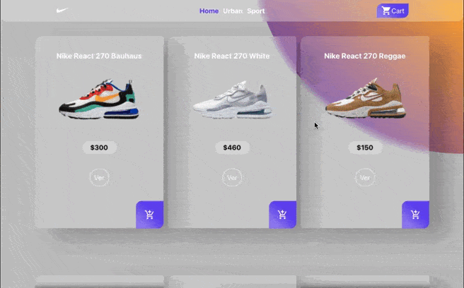

# Bienvenidos a una nueva tienda Nike

Este shop fue diseñado para que los fans de Nike puedan conseguir exclusivamente el modelo  de más alta tecnología de la marca, las Nike React 270. La app fue desarrollada con React JS en contexto de una primera experiencia con esta tecnología.

# Instalación

Para instalar la app y ejecutarla deberá seguir estos pasos...

 1. Clonar este repositorio "git clone https://github.com/Emilianodelarc/tienda-f-n.git"
 2. debera ingresar el siguiente comando "npm install"  para instalar "node modules"
 3. al finalizar ejecutar con "npm start" 

 ## Dependencias

 3. [Material UI: ](https://material-ui.com/)utilizado para los iconos de la app.
 4. [Firebase](https://firebase.google.com/) utlizado para almacenar el stock de productos con Firestore.
 5. [React-Router-Dom](https://reactrouter.com/web/guides/quick-start)